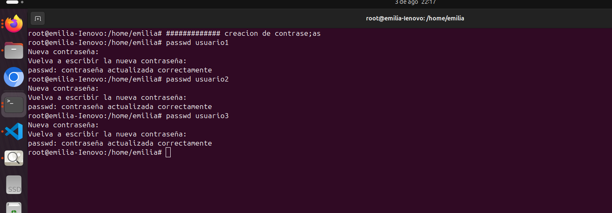
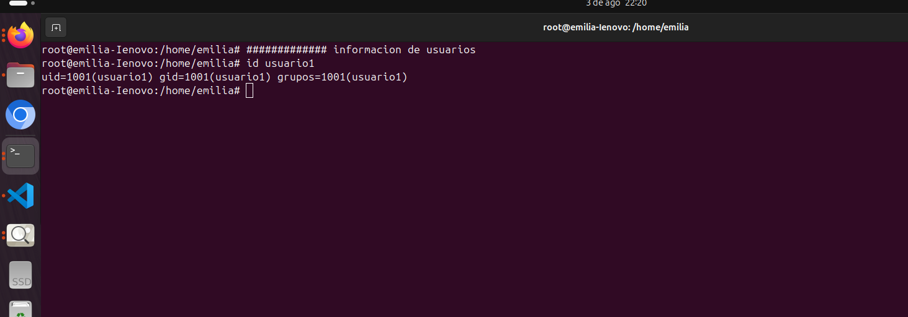
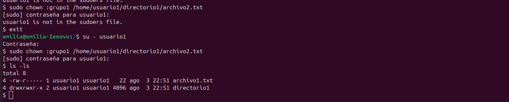
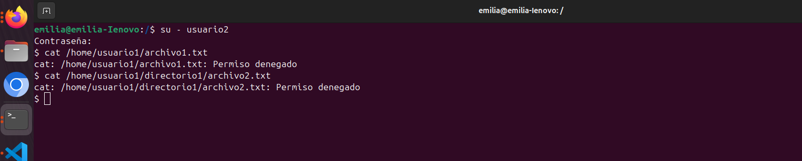
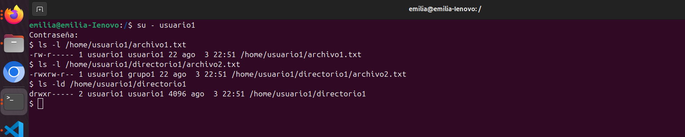

## ROSA EMILIA BOCHE NAZ
## SISTEMAS OPERATIVOS 1
***

# ACTIVIDAD 3

### PRIMERA PARTE

##### CREACION DE USUARIOS
Se crea usuario, usuario2, usuario3

##### CREACION DE PASSWORD
Se ingresa nueva contrase;a a usuario1, usuario2 y usuario3

#### INFORMACION DE USUARIO1

#### ELIMINACION DE USUARIO3

### SEGUNDA PARTE

#### CREACION DE GRUPOS

#### AGREGAR USUARIO A GRUPO

#### VERIFICAR MEMBRESIA

#### ELIMINAR GRUPO

### GESTION DE PERMISOS

#### CREACION DE PERMISOS
##### Creacion de archivos y directorios

Se crea un archivo y un directorio para ejemplo, luego se listan los permisos

#### CAMBIO DE PERMISOS DE FORMA NUMERICA Y SIMBOLICA

#### CAMBIAR GRUPO PROPIETARIO

#### CONFIGURAR PERMISOS DE DIRECTORIO

### COMPROBACION DE ACCESO
 

 ### VERIFICACION FINAL
 

 ## SECCION OPCIONAL
   :pushpin:  ¿Por qué es importante gestionar correctamente los usuarios y permisos en un sistema operativo? Principalmente por temas de seguridad, debido a que pueden existir usuarios con diferentes roles 
    :pushpin: ¿Qué otros comandos o técnicas conocen para gestionar permisos en Linux? De manera grafica 