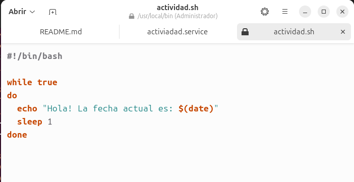
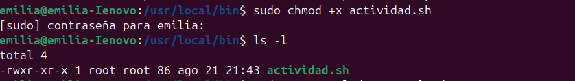
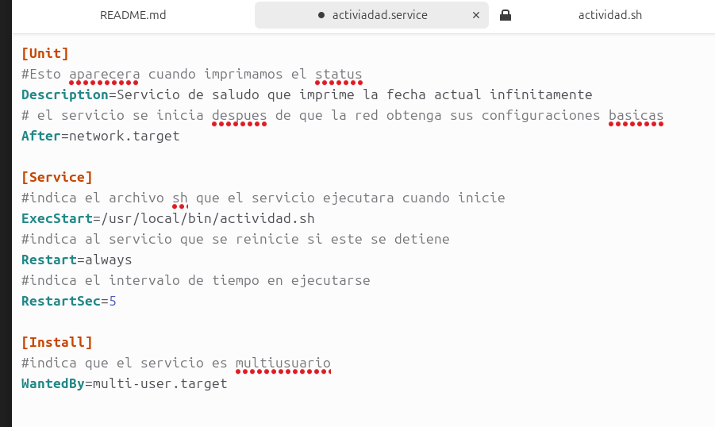
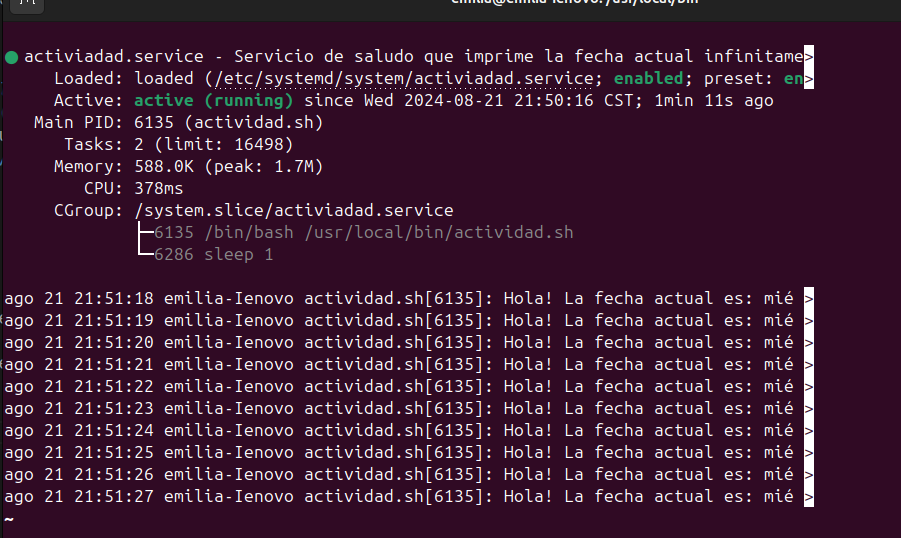

ACTIVIDAD 4    
Systemd Unit
==============

Rosa Emilia Boche Naz 200915633  

--------------------------

  

Creacion de Servicio 
--------------------  

  
1. Se crea un script que con las instrucciones que se desea ejecutar. Para este ejemplo se imprimira un saludo con itereaciones     

2. Se guarda el script en la ruta ***usr/local/bin/***
3. Le agregamos permisos de ejecución 
4. Creamos una unidad, para ello creamos un archivo (actividad.service) y lo guardamos en **/etc/systemd/system/**

5. Recargamos la configuración de systemd 
>sudo systemctl daemon-reload
6. Para indicar que el servicio se inicie al mismo tiempo que el sistema ejecutamos el comando:
>sudo systemctl enable saludo.service
7. Para ejecutar manualmente el servicio ejecutamos el comando:
> sudo systemctl start saludo.service
8. Para verificar el estado del servicio ejecutamos el comando:
>sudo systemctl status saludo.service

