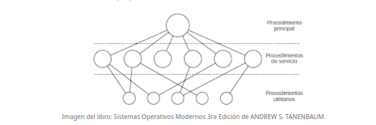
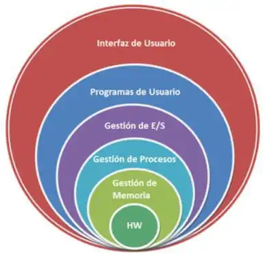
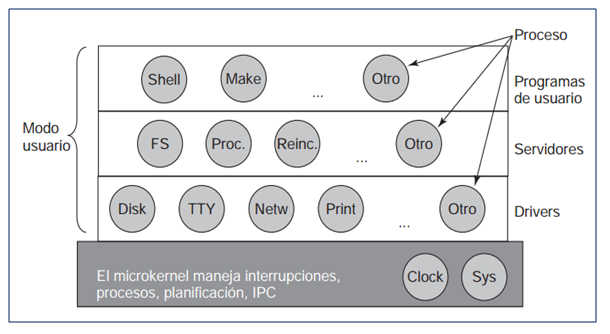
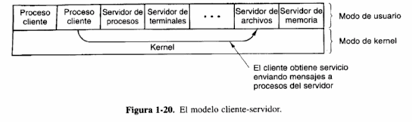
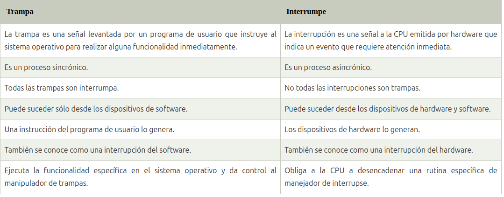

### UNIVERSIDAD DE SAN CARLOS
### FACULTAD DE INGENIERIA
### SISTEMAS OPERATIVOS 1

_ROSA EMILIA BOCHE NAZ_ 
_200915633_

--------------------------
<h1 style="text-align: center;">ACTIVIDAD 5</h1>

 
 
<h3> TIPOS DE KERNEL </h3>

*_MONOLITICOS_*

:pencil: Se describre como una serie de procedimientos entrelazados entre sí

:pencil: Unico programa de gran tamaña

:pencil: Se ejecuta en modo kernel

:pencil: compila cada procedimiento individualmente y luego se vinculann entre si

:pencil: Diseño de ejecución rápida

:pencil: Las llamadas al sistema se colocan en un lugar definico (la pila)

<i class="fas fa-lightbulb"> Ejemplo: Linux</i>

 
<BAR

*_SISTEMAS DE CAPAS_*

:pencil: Diseño más jerárquico

:pencil: Se basa en crear capas de procedimientos, donde la capa superior tiene mayores privilegios que la inferior

:pencil: Todas las capas estan en el kernel
:pencil: El primer kernel de este tipo consistia en seis capas
- La capa uno se encarga de administrar memoria, de manera que las capas superiores unicamente solicitaban la misma 
- La capa dos, se encargaba de comunicación entre procesos
- La capa tres administraba los dispositivos I/O
- La capa cuatro, se ubicaban los programas de los usuarios
- La capa cinco el proceso del operador

<i class="fas fa-lightbulb"> Ejemplo: MULTICS</i>

 
 

*_MICROKERNELS_*

:pencil: Similar al sistema de capas
:pencil: La diferencia con el sistemas de capas se debe a que solo algunas capas estan en el kernel
:pencil: Evita que en caso de un fallo se detenga todo el sistema
:pencil: Esto brinda más confiabilidad y estabilidad 

<i class="fas fa-lightbulb"> Ejemplo: MINIX</i>

 
 

*_SISTEMAS CLIENTE-SERVIDOR_*
:pencil: Cuenta con una serie de componentes encargados de funciones especificas
:pencil: Un proceso solo puede acceder a su espacio de memoria
:pencil: Los procesos se comunican con otros poe medio de mensajes como un servicio
:pencil: Las peticiones son tomadas de la  misma forma no importando si son locales o en otra máquina

:pencil: Ideal para sistemas distribuidos
:pencil: Con el tiempo ha aumentado su capacidad de cálculo, memoria y alamacenamiento

<i class="fas fa-lightbulb"> Ejemplo: WINDOWS</i>
 

<h3>USER VS KERNEL MODE</h3>
 

*_USER MODE_*

:pencil: Es el que se ejecuta cuando un programa inicia en un sistema operativo

:book: Por ejemplo cuando ejecutamos un programa en Windows, este crea un proceso y un espacio de direcciones virtuales.
Estos procesos tienen menos privilegios y no pueden acceder a los recursos del sistema de forma directa.
Para lograr esto debe pasar por el kernel del SO y realizar las llamadas desde este punto.

 

*_KERNEL MODE_*

:pencil: Es el programa central en el que se basan los demás componenentes
:pencil: Se utiliza para acceder a los componentes del hardware
:pencil: Decide que  procesos deben ejecutarse y la interaccion del software y hardware
:pencil: Es el programa con más privilegios

:book: Si un programa en modo usuario slicita acceso a hardware llama al kernel mediante una llamada al sistema, cuando se realiza esta solicitud el CPU cambia de modo usuario a modo kernel en el momento de la ejecución; lueg de completar la tarea el CPU vuelve a modo usuario.

 
 
<h3>INTERRUPTIONS vs TRAPS</h3>

 

*_TRAP_*
:pencil: Se producen cuando el programa de usuario invoca funcionalidades del SO
:pencil: Es una interrupción producida por el software 
:pencil: Los factores que la causan son varios, incluyendo errores, acceso a memoria de forma ilegal
:pencil: traps son eventos sincronicos porque la ejecución de las instrucciones pueden provocar más traps
:pencil: Otro tipo de traps son las que el programa solicita al SO que busque un determinado servicio, y cuando este ultimo lo encuentra, generara un trap para permitir al programa que acceda a los servicios.
:pencil: Los traps son diseñados para interactuar con el SO

:pen: Por ejemplo: Cuando se solicita mostrar en pantalla, esto genera una trap y el SO mostrara lo solicitado

*_INTERRUPTIONS_*
:pencil: Son señales emitidas por el software o hardware cuando un proceso o evento requiere atención inmediata
:pencil: Pueden suceder en cualquier momento
:pencil: Es dedicado en un CPU
:pencil: el CPU solo tiene un pin de interrupción pero hay varios dispositivos de hardware
:pencil: El controlador de interrupciones es el encargado de compartir el pin de interrupción con varios dispositivos
:pen: Por ejemplo cuando se hace click en una tecla se produce una interrupción, al finalizar la tarea el CPU vuelve al estado original.
 
