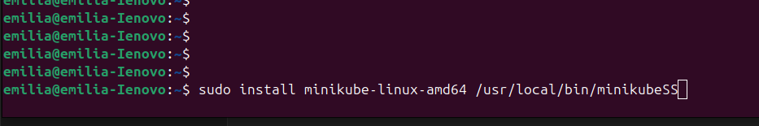
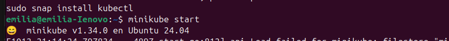

***ROSA EMILIA BOCHE NAZ***
***200915633***
### Primeros pasos con K8s Ubuntu

1. Instalar dependencias
> sudo apt-get update && sudo apt-get install -y curl apt-transport-https
2. Instalar minikube

>curl -LO https://storage.googleapis.com/minikube/releases/latest/minikube-linux-amd64
sudo install minikube-linux-amd64 /usr/local/bin/minikube

3. Inicializar minikube
>minikube start

4. Desplegar contenedor NGINX 
>Dkubectl create deployment nginx --image=nginx

5. Exponer servicio
>kubectl expose deployment nginx --type=NodePort --port=80

6. Acceder al servicio
>minikube service nginx

### Pregunta: ¿En un ambiente local de Kubernetes existen los nodos masters y workers? ¿Cómo funciona esto?

De manera local todo corre en un solo nodo teniendo las funciones tanto de mastes como de workers con la premisa que en un ambiente local no es necesario tomar en cuenta la escabilidad y disponibilidad 